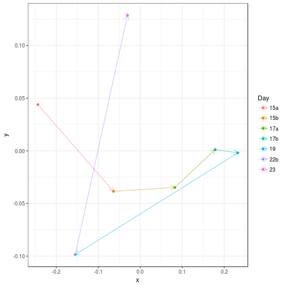

# Taxonomic and Functional Profiling


## Taxonomic profiling

Login to VM created yesterday.

We are going to process a subset of the classic Sharon et al. (2011) Infant Gut data set:
```
cd ~/Projects/InfantGut
ls ReadsSub
```

How many reads are in each sample and how many samples are there?

Now we will profile the Infant Gut reads with Kraken. We will use forward reads only:

```
mkdir Kraken
for file in ReadsSub/*R1*fastq
do
    base=${file##*/}
    stub=${base%_R1.fastq}
    echo $stub
    kraken --db ~/Storage/Databases/minikraken_20171019_8GB --threads 8 --preload --output Kraken/${stub}_R1.kraken $file
done
```


Try to understand the anatomy of the above commands.

We match against the 'minikraken' database which corresponds to RefSeq 2014.

Would we expect the profile to differ between R1 and R2?

Can you edit the above to run the R2 reads?

Look at percentage of reads classified. Infant guts are well studied communities.

The output is just a text file:

```
head Kraken/sample1_R1.kraken
```

And we can generate a report:

```
kraken-report --db ~/Storage/Databases/minikraken_20171019_8GB  Kraken/sample1_R1.kraken >  Kraken/sample1_R1.kraken.report
```

We can get a report of the predicted genera:
```
cat  Kraken/sample1_R1.kraken.report | awk '$4=="G"'
```

How would we get the species classifications, can you edit the above to do that?

Some people prefer a different format:
```
kraken-mpa-report --db ~/Storage/Databases/minikraken_20171019_8GB  Kraken/sample1_R1.kraken  > Kraken/sample1_R1.kraken.mpa.report
```

Compare with reverse reads what is the major difference?

Will combine the two for analysis below.

```
for file in Kraken/*R1.kraken
do
    stub=${file%_R1.kraken}
    rfile=${stub}_R2.kraken
    cat $file $rfile > ${stub}_R12.kraken
done
```


Now lets get reports on all combined samples:
```
for file in Kraken/*_R12.kraken
do
    stub=${file%.kraken}
    echo $stub
    kraken-report --db ~/Storage/Databases/minikraken_20171019_8GB $file >  ${stub}.kraken.report
done
```

Having done this we want to get one table of annotations at the genera level for community comparisons:

```
for file in Kraken/*_R12.kraken.report
do
    stub=${file%_R12.kraken.report}
    cat  $file | awk '$4=="G"' > $stub.genera
done
```

And then run associated script:
```
CollateK.pl Kraken > GeneraKraken.csv
```
There is a clear shift in genera level structure over time.




We can generate this plot either locally or on the server by:

```
cp ~/repos/Ebame4/Meta.csv .
Rscript ~/repos/Ebame4/scripts/GeneraFreqNMDS.R 
```


Discussion points:
1. Non-metric multidimensional scaling
2. Multivariate permutational ANOVA

<a name="functionalprofiling"/>


## Functional gene profiling of Infant Gut reads

To perform functional gene profiling we will use Diamond to map against the KEGG database. 
First we will set an environmental variable to point to our copy of the Kegg:
```
export KEGG_DB=~/Storage/Databases/KeggUpdate
```
```
cd ~/Projects/InfantGut
mkdir KeggD
for file in ReadsSub/*R1.fastq
do 
   
   stub=${file%_R1.fastq}
   stub=${stub#ReadsSub\/}
   echo $stub
   if [ ! -f KeggD/${stub}.m8 ]; then
    echo "KeggD/${stub}.m8"
    diamond blastx -d $KEGG_DB/genes/fasta/genes.dmnd -q $file -p 8 -o KeggD/${stub}.m8
   fi
done
```

With more time would probably apply the diamond --sensitive option or similar.

Having mapped reads to the KEGG genes we can collate these into ortholog coverages:
```
for file in KeggD/*.m8
do
    stub=${file%.m8}

    echo $stub
    
    python ~/repos/Ebame4/scripts/CalcKOCov.py $file $KEGG_DB/ko_genes_length.csv $KEGG_DB/genes/ko/ko_genes.list > ${stub}_ko_cov.csv&

done

```

Note this script uses a hard coded read length of 150 nt or 50 aa.

Discussion points:

1. What is coverage?

2. What pipelines exist for doing this, HumanN? Could we use kmers for functional profiling?

3. What is the [KEGG](http://www.genome.jp/kegg/pathway.html)

We collate these into a sample table:
```
mkdir FuncResults
CollateKO.pl KeggD > FuncResults/ko_cov.csv
```

and also KEGG modules:
```
for file in KeggD/*ko_cov.csv
do
    stub=${file%_ko_cov.csv}

    echo $stub
    python ~/repos/Ebame4/scripts/MapKO.py $KEGG_DB/genes/ko/ko_module.list $file > ${stub}_mod_cov.csv& 
done
```

Collate those across samples:
```
CollateMod.pl KeggD > CollateMod.csv
mv CollateMod.csv FuncResults
```

What about module names? My former PDRA (Umer Ijaz) has a nice one liner for this:

```
cd FuncResults
awk -F"," 'NR>1{print $1}' CollateMod.csv | xargs -I {} curl -s http://rest.kegg.jp/find/module/{} > ModNames.txt
cd ..
```

We can view modules as multivariate data just like the genera relative frequencies. Is there a stronger or weaker relationship between time and module abundance than there was 
for the genera abundances?
